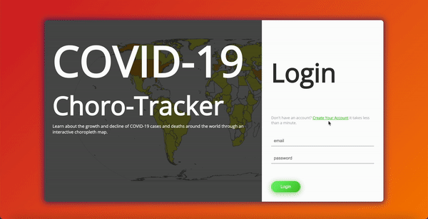

# Choro-Tracker: A Full-Stack Interactive Tracker for Global COVID-19 Data
## Description
Choro-Tracker allows a user to interact with a global COVID-19 dataset through use of a Chart.js choropleth map and line graph.
## Technologies Used
Python | Javascript | React | AJAX | Flask | SQL | HTML | CSS | Bootstrap
## YouTube Video Project Presentation
[Watch an explanation of my project on YouTube!](https://www.youtube.com/watch?v=H0DfmBLnnho&ab_channel=FernandaP%C3%A9rezGuti%C3%A9rrez)
## Registration and Login Functionality
The app opens on the login page where the user can either login with an existing email and password or register a new account. If registering, the user can  input their first name, last name, email, and password, and are then redirected to the login page where they can then input their newly created credentials.

