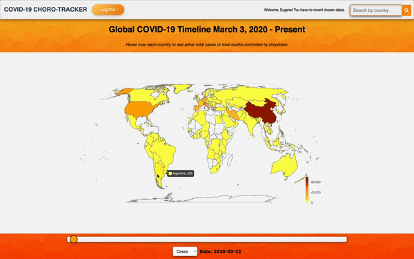

# Choro-Tracker: A Full Stack Interactive Tracker for Global COVID-19 Data
## Description
Choro-Tracker allows a user to interact with a global COVID-19 API dataset through use of a Chart.js choropleth map and line graph.
## YouTube Video Project Presentation
[Watch me explain my project on YouTube!](https://www.youtube.com/watch?v=H0DfmBLnnho&ab_channel=FernandaP%C3%A9rezGuti%C3%A9rrez)
## User Flow
### Registration and Login
The app opens on the login page where the user can either login with an existing email and password or register a new account. If registering, the user can  input their first name, last name, email, and password, and are then redirected to the login page where they can input their newly created credentials.

The Sweet Alert package was used to create beauiful, responsive, customizable, and accessible popup boxes for displaying alerts.

### Map Navigation
Once the user has logged in, the first thing they are presented with is a global COVID-19 map. The map was created using the Chart.js library where I chose to use a choropleth map to diplay total cases and total deaths. A choropleth map was most suitable given its ability to clearly display an aggregate summary (e.g. total cases, total deaths, population, etc.) of a geographic characteristic.

Choro-Tracker allows a user to interact with the map through a slider where they can choose the date and hover over each country to view its data. The slider itself uses javascript to detect a change triggered by the user. In order for the correct data to appear on the map, the user’s chosen date is queried on a local database with SQLAlchemy. Cases and deaths data is then fetched for every country on the map. 

### Country Search Functionality
The user also has the ability to search by country and see the statistics pertaining to that particular country.

## Technologies Used
### Main Tech Stack
This is a single-page app built primarily with:

* Python
* Flask
* PostgreSQL
* JavaScript
* React.js

### Other Libraries and Frameworks

* SQLAlchemy
* Chart.js (open-source JavaScript library for data visualization)
* Jinja (used to create HTML, XML or other markup formats that are returned to the user via an HTTP request)
* Bootstrap

### APIs

* RAPID API: COVID-19 API by API-SPORTS

